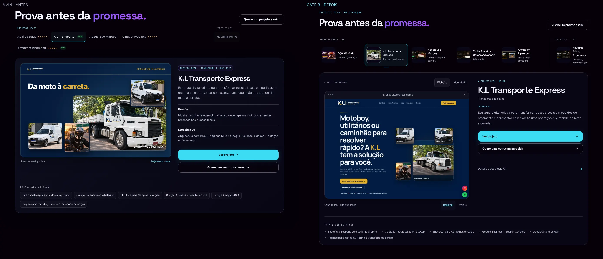
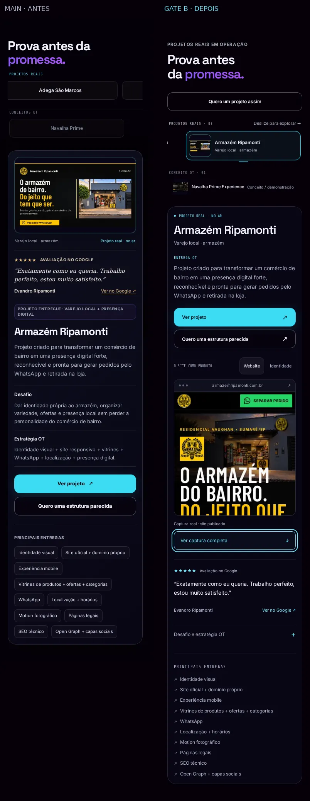

# Gate B — OT Premium V2 integrado à home

A vitrine de `#projetos` passa a apresentar os sites publicados como produto: screenshot real dominante, cinco clientes e Navalha Prime separado como conceito. A composição aprovada no PR #90 foi adaptada à home, com sua tipografia, atmosfera, título e navegação existentes.

Base `main`: `4f2550af3e0211b54d4694de6d2e6fce80442dfd` (PR #89). Referência Gate A: PR #90, `8144b9755b675e632957814faac135a995badccc`. Branch nova `feat/ot-premium-v2-gate-b`, derivada da main; sem merge do protótipo. PR #90 continua preservado. Gate B permanece para aprovação visual e funcional de Alexandre; sem merge ou publicação.

## Implementação

- `projects` continua sendo o único catálogo editorial e permanece byte-identicamente aprovado. Nome, segmento, descrições, entregas, desafio/estratégia, três avaliações e fontes oficiais vêm desse objeto.
- Um módulo contém templates compartilhados entre HTML inicial e runtime, descritores de mídia e controlador. `build-showroom.mjs --check` impede divergência do HTML inicial. Não há segundo JSON editorial, framework ou dependência de produção.
- O renderer e os listeners antigos foram substituídos. `renderProject()` é somente a ponte usada pela faixa de cinco provas reais existente. As classes de compatibilidade de analytics permanecem; o painel usa `data-selected-project` para que os controles não emitam seleções extras.
- Miniaturas manuais, seleção explícita, setas/Home/End, roving tabindex, painel nomeado e status anunciado. Resize revela novamente a seleção, inclusive dentro do mesmo breakpoint; não interfere no scroll manual.
- Website/Identidade e Desktop/Mobile conforme o case. Dispositivo, mídia e ARIA são sincronizados; foco é transferido antes de esconder controles. Pedidos antigos não vencem uma seleção mais recente. O case anterior permanece durante o decode solicitado, com `aria-busy`.
- No tablet/celular, cliente, descrição comercial e os dois CTAs precedem a captura. Mobile tem prévia de 240–320px e expansão opcional, com a imagem integral disponível. Sem JS, o K.L inicial e a captura completa continuam acessíveis.
- Motion de 260ms e microtransições locais; reduced motion cancela movimentos. Sem autoplay, parallax adicional, tilt ou shaders.
- Quinze mídias aprovadas foram promovidas sem alteração de bytes do PR #90. Ripamonti reutiliza as screenshots do PR #89. Outros visuais de identidade e demonstração reutilizam assets existentes. Proveniência e hashes em [ASSET-SOURCES.json](ASSET-SOURCES.json).

## Preservação e escopo

[Auditoria](scope-audit.json): 156 dos 165 arquivos da base permanecem idênticos. Nove arquivos existentes são alterados; a limpeza nos quatro estilos compartilhados e no CSS inline remove exclusivamente seletores obsoletos da vitrine, mantendo declarações de seletores mistos que pertencem a outras áreas.

O teste compara diretamente markup de HERO, Soluções, Método, Sobre, produtos, FAQ e contato. Compara o catálogo e todo o JavaScript inline, exceto o renderer substituído. Core de analytics, Terra, cena cósmica, mobile, soluções e `ot-v2.js` ficam idênticos. Solução 03, metadados, consentimento, rodapé, mensagens e fontes oficiais permanecem aprovados. Assets antigos não foram excluídos.

[Lista de arquivos e justificativas](FILES.md) · [Decisões visuais](DECISIONS.md).

## Evidências

Comparação da **home completa**, mesma base e viewports; K.L inicial nas páginas completas. Galerias específicas incluem K.L Transporte, Açaí do Dudu e Armazém Ripamonti. As capturas de seção ocultam apenas controles fixos externos para não encobrir o case; home e passagem mantêm a interface real. Nenhum elemento do projeto é substituído ou inventado.

| Captura da home antes/depois | Arquivo |
| --- | --- |
| 1366 × 768 | [Home completa](evidence/home-1366x768.webp) |
| 1440 × 900 | [Home completa](evidence/home-1440x900.webp) |
| 1920 × 1080 | [Home completa](evidence/home-1920x1080.webp) |
| 768 × 1024 | [Home completa](evidence/home-768x1024.webp) |
| 360 × 800 | [Home completa](evidence/home-360x800.webp) |
| 390 × 844 | [Home completa](evidence/home-390x844.webp) |
| 430 × 932 | [Home completa](evidence/home-430x932.webp) |

| Galeria comparativa | K.L Transporte | Açaí do Dudu | Armazém Ripamonti | HERO → Projetos |
| --- | --- | --- | --- | --- |
| 1440 × 900 | [K.L](evidence/kl-desktop.webp) | [Açaí](evidence/acai-desktop.webp) | [Ripamonti](evidence/ripamonti-desktop.webp) | [Passagem](evidence/passage-desktop.webp) |
| 768 × 1024 | [K.L](evidence/kl-tablet.webp) | [Açaí](evidence/acai-tablet.webp) | [Ripamonti](evidence/ripamonti-tablet.webp) | [Passagem](evidence/passage-tablet.webp) |
| 390 × 844 | [K.L](evidence/kl-mobile.webp) | [Açaí](evidence/acai-mobile.webp) | [Ripamonti](evidence/ripamonti-mobile.webp) | [Passagem](evidence/passage-mobile.webp) |

As cópias WebP de páginas completas mantêm proporção e usam até 1000px de largura por coluna para revisão. As PNG originais, com resolução integral nos sete viewports e capturas dos dois motores, ficam no artefato do workflow. Seções mantêm largura original até 1440px. [Manifesto de capturas e dimensões](evidence/screenshots.json).






## Testes e desempenho

Local Chromium: nove cenários (sete viewports + dois reduced motion), resize/races e consentimento/analytics aprovados. HTML sem JS, doze popups de projeto/WhatsApp, teclado/foco e zoom adicional também exercitados. O complemento repete resize incluindo 390→430 dentro do breakpoint e compara CSS zoom com a base.

A regressão existente aprovou três jornadas completas: reduced motion desktop/mobile e fallback forçado sem WebGL. Soluções aprovadas nas sete resoluções e dois estados reduzidos. Zero erros JS, 404 de imagens ou overflow nos viewports reais.

[Home e links — dados locais](evidence/complete-home-local.json) · [Medições com janela CLS e resize adicional](evidence/performance-local.json) · [Regressão existente](evidence/existing-regression-local.json) · [Soluções](evidence/solutions-local.json).

### Home completa: comparação de laboratório

Medianas de três contextos frios por versão/viewport. O transporte opcional das fontes é aquecido igualmente antes da medição; o cache de cada contexto permanece frio. Mesmo Chromium, servidor HTTP, fontes canônicas, consentimento recusado, movimento reduzido e sem throttling artificial. CLS é a maior sessão com pausas de até 1s/duração de até 5s. Registros individuais e fontes dos shifts são preservados.

| Viewport | LCP antes → depois | CLS antes → depois | Corpos transferidos antes → depois | Event Timing máx. antes → depois |
| --- | --- | --- | --- | --- |
| 1440px | 280 → 252ms | 0.17426 → 0.17400 | 1487.3 → 1441.9KiB (-3.1%) | 96 → 72ms |
| 390px | 148 → 148ms | 0.66145 → 0.65957 | 1058.5 → 805.4KiB (-23.9%) | 48 → 48ms |

O peso inicial cai com as screenshots otimizadas e a retirada de estilos/markup obsoletos. JS externo + inline passa de 128387 para 139764 bytes (+11377 bytes), custo explícito do novo controlador, templates e descritores sem dependências. Não é apresentada como redução de JS.

O maior CLS já existe na base; os traços apontam para o HERO/grid e elementos iniciais, presentes nas duas versões, enquanto a integração não eleva o valor. Fontes e ajustes existentes de inicialização são candidatos; não foi feita uma investigação causal isolada nem mudança fora do escopo. O CLS alto deve ser acompanhado separadamente. Nenhuma métrica da prévia isolada foi usada para comprovar a home.

Primeira troca K.L→Açaí: o novo controlador aguarda o decode solicitado antes de trocar o conteúdo; o tempo do driver inclui essa espera. A base troca texto antes de a imagem ficar pronta. Os registros trazem tempos por case; isso não equivale a INP. LCP/interações em localhost não são promessa de desempenho em rede móvel real.

Resultados definitivos de Chromium/WebKit, regressão existente e CodeQL são registrados na descrição do PR do Gate B, vinculados ao commit e aos runs. O workflow guarda as PNG originais e o relatório dos dois motores por 30 dias; os comparativos WebP permanecem versionados.


## Reproduzir sem publicação

```bash
python3 -m http.server 4173 --bind 127.0.0.1
# http://127.0.0.1:4173/
node scripts/build-showroom.mjs --check
OT_QA_ENGINES=chromium,webkit node scripts/verify-showroom.mjs
```

O runner serve a home integrada e uma worktree da main base no mesmo processo. Requer o Playwright já usado no projeto e seus navegadores de teste. Não gera URL hospedada nem aciona Pages. Workflows de segurança e regressão acompanham o PR.

## Limitações e aprovação

Chromium local usa o fallback Canvas2D neste ambiente sem WebGL; reduced motion e o fallback foram exercitados, mantendo a implementação da Terra. WebKit/Linux é simulação, sem Safari/iPhone físico, saída real de áudio ou execução com leitor de tela humano. Sem envio de WhatsApp. URLs, mensagens, popups e `noopener` são verificados; o destino de rede dos tags é interceptado, mantendo a implementação real de consentimento e filas de eventos.

O teste adicional de CSS zoom 200% compara também a base: o header/rodapé existentes produzem overflow nesse modo artificial. A vitrine não acrescenta overflow. Os sete viewports reais têm zero overflow; CSS zoom não equivale ao zoom nativo do navegador.

As métricas são de laboratório na **home completa**, com três contextos frios por versão e viewport, mesmo servidor HTTP, fontes, consentimento recusado e movimento reduzido. Corpos transferidos não incluem cabeçalhos nem compressão da CDN. Máximo Event Timing e tempo do driver até o case pronto não são INP de campo. CLS usa a maior janela de sessão; fontes dos deslocamentos são registradas para separar a base de uma regressão da integração.

Pesquisa live Refero estava indisponível por assinatura no Gate A; a referência é a composição aprovada do PR #90 e o DESIGN.md. Nada novo é atribuído a pesquisa live.

**Pendente: aprovação visual e funcional expressa de Alexandre. PR em rascunho, sem merge e sem publicação automática.**
