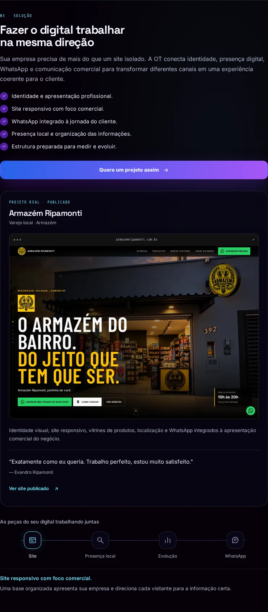

# Solução 03 — Armazém Ripamonti

Rascunho para aprovação de Alexandre. Não fazer merge nem publicar sem autorização expressa.

## Problema e cadeia de renderização

Base: `main` no commit `b3ddba9`, após o PR #88. `solutions.digital` ainda continha o conceito Mini Mercado & Empório; `tuneSolutions()` reescrevia o texto e o CTA; `ot-solution-configurator.js` observava `data-solution` para montar os controles. `ot-surface-motion.js` já fornecia a resposta ao ponteiro. O carregador `ot-analytics.js` carregava analytics core, depois `ot-v2.js`.

A origem comercial agora é `solutions.digital`, com uma referência a `projects.ripamonti`. O renderizador reutiliza desse registro o nome, URL, depoimento e previews. A capa da vitrine principal permanece intocada. `tuneSolutions()` deixa de sobrescrever a Solução 03 e respeita uma seleção feita antes de seu carregamento. O atributo `data-generate-lead` é renderizado junto ao CTA, substituindo o observador que o adicionava depois. Nenhum listener de tracking foi acrescentado.

## Direção e decisões visuais

Alvo: experiência OT já aprovada, `DESIGN.md`, componentes e padrões do repositório, mais o briefing desta tarefa. Refero respondeu `NO_SUBSCRIPTION` às novas pesquisas; não houve acesso a novos styles. Foram aplicadas as referências locais `craft-details.md` e `motion.md` e os princípios explicitamente fornecidos pelo Alexandre.

| Decisão | Fonte / papel | Aplicação |
|---|---|---|
| Produto como prova dominante | Briefing: Webflow e Apple | Captura fiel do site em moldura discreta de navegador; área ampla para a entrega. |
| Cliente em primeiro plano | Briefing: PostNew | Fachada e marca presentes na captura real do projeto publicado. Sem geração de imagem. |
| Bordas discretas e alinhamento | Briefing: Linear; `DESIGN.md` | Tokens e fontes OT, borda fina, raio 22/18px e ausência de brilhos decorativos novos. |
| Uma ação comercial principal | Briefing: Stripe; contrato Button | CTA OT à esquerda; link secundário para verificar o projeto à direita. |
| Mobile próprio | Briefing e craft Images/Touch | `picture` seleciona a captura mobile até 600px; sem celular sobreposto; áreas de toque de 48px. |
| Movimento contido | Motion local e sistema OT | Entrada 220ms/4px, movimento do preview limitado a 30% do ponteiro já existente, texto estável, reduced motion sem animação. |
| Preservar os controles aprovados | Escopo do usuário | Controles explicativos mantidos; à esquerda no desktop e depois do case no mobile. |

As capturas foram feitas em `https://armazemripamonti.com.br/` em 08/10/2026, depois de dispensar o aviso com “Entendi”. Desktop 1440×1000 e mobile 390×844. Compressão WebP: 109.996 e 39.588 bytes. As proporções completas são mantidas e reservadas antes do carregamento. O mobile recebe uma imagem diferente via `picture`, sem baixar uma montagem de aparelhos. As capturas são estáticas e podem precisar de atualização se o site do cliente mudar.

## Arquivos de implementação

- `index.html`: dados, renderizador editorial, CTA e referências de cache.
- `assets/css/ot-solution-case.css`: componente exclusivo e regras limitadas à Solução 03.
- `assets/js/ot-v2.js`: remove a reescrita antiga e o observador de lead.
- `assets/js/ot-solution-configurator.js`: alinha apenas as explicações da rota digital ao escopo aprovado.
- `assets/js/ot-analytics.js`: somente versão de cache do `ot-v2.js`; instrumentação intacta.
- `assets/img/projetos/ripamonti/armazem-ripamonti-site-{desktop,mobile}-v1.webp`: capturas reais otimizadas.
- `scripts/verify-solutions.mjs`: regressão específica e evidência de analytics.
- `.github/workflows/immersive-qa.yml`: acrescenta a regressão específica ao workflow existente.
- Esta pasta: capturas e evidências para revisão.

## Validação

Ambiente: `http://127.0.0.1:4173`, Chromium/Linux via Playwright. Browser plugin not available. Nenhuma dependência foi acrescentada ao site. Fontes Google foram transportadas pelo host no teste local; não substituídas por outras fontes. O workflow existente de projetos foi executado localmente em dez cenários, incluindo áudio real, seis cases, cinco projetos na faixa e reduced motion.

| Viewport da Solução 03 | Resultado |
|---|---|
| 1366×768, 1440×900, 1920×1080 | Passou |
| 768×1024 | Passou |
| 360×800, 390×844, 430×932 | Passou |
| 1440×900 e 390×844 com reduced motion | Passou |

| Verificação | Resultado / evidência |
|---|---|
| Identidade da página / conteúdo / ausência de overlay | Passou |
| Seleção das três soluções, retorno, reabertura e seis trocas rápidas | Passou; seleção final correta e único case no DOM |
| Mesma aba selecionada novamente | Preserva o mesmo elemento do case, evitando reconstrução desnecessária |
| Teclado | Home/End/setas; Tab até o CTA e o link; Enter nos quatro controles |
| Foco / toque | Outline visível; CTA e link com pelo menos 44px |
| Imagens | Sem 404; imagem correta por viewport; proporção natural sem cortes |
| Console / JavaScript | Nenhum erro nos cenários executados |
| Overflow | `scrollWidth <= clientWidth` em todos os cenários |
| Reduced motion | Entrada e movimento do preview desativados |
| Analytics com consentimento | Três cliques após trocas = 3 `generate_lead`, 3 `click_whatsapp` e 3 Meta `Lead` |
| Analytics com recusa | Zero eventos de conversão |
| Destinos | WhatsApp correto, mensagem integral, nova aba; projeto externo com `opener === null` |
| Escopo | HTML das áreas preservadas idêntico à base; ver `scope-audit.json` |
| Sintaxe / whitespace | Checagem Node e `git diff --check` passaram |

Fluxo: home → “Meu digital está todo solto” → case Armazém Ripamonti → CTA contextual / site publicado. O CTA abre `wa.me/5511912459144` com a mensagem: “Olá, OT! Vi o projeto Armazém Ripamonti na Solução 03 e quero avaliar uma estrutura semelhante para minha empresa.”

Em QA, os destinos externos dos cliques foram interceptados para verificar URL, aba e eventos sem enviar mensagens nem registrar leads de teste em produção. A disponibilidade real do site do cliente foi verificada separadamente (HTTP 200 e captura do conteúdo publicado). Não foi feita verificação de entrega de mensagem nem de recebimento nos servidores GA/Meta.

Resultados: `solution-report.json`, `project-regression-report.json` e `scope-audit.json`. Comandos: `node scripts/verify-immersive.mjs` com `OT_QA_FOCUS=projects`; `node scripts/verify-solutions.mjs`. Ambos são executados pelo workflow Immersive home QA. O status final do GitHub e do CodeQL está no PR.

Limitações: Safari, Firefox e aparelhos físicos não foram testados nesta etapa. Não houve consulta live aos styles do Refero. Os arquivos antigos de Mini Mercado foram auditados: as duas referências estavam em `solutions.digital`; não apareceram outras referências nos arquivos rastreados. Os arquivos foram preservados, sem remoção.

## Evidência visual

As capturas de componente ocultam temporariamente os controles fixos da página apenas na captura, para não atravessarem o conteúdo ao fotografar uma seção longa. O workflow também guarda capturas de viewport e foco com os controles reais. A implementação não oculta esses controles.

Antes:

Depois:

Tablet:

Mobile:

Demais capturas: `solution-1366x768.webp`, `solution-1440x900.webp`, `solution-1920x1080.webp`, `solution-360x800.webp`, `solution-430x932.webp` e `before-mobile.webp`.
